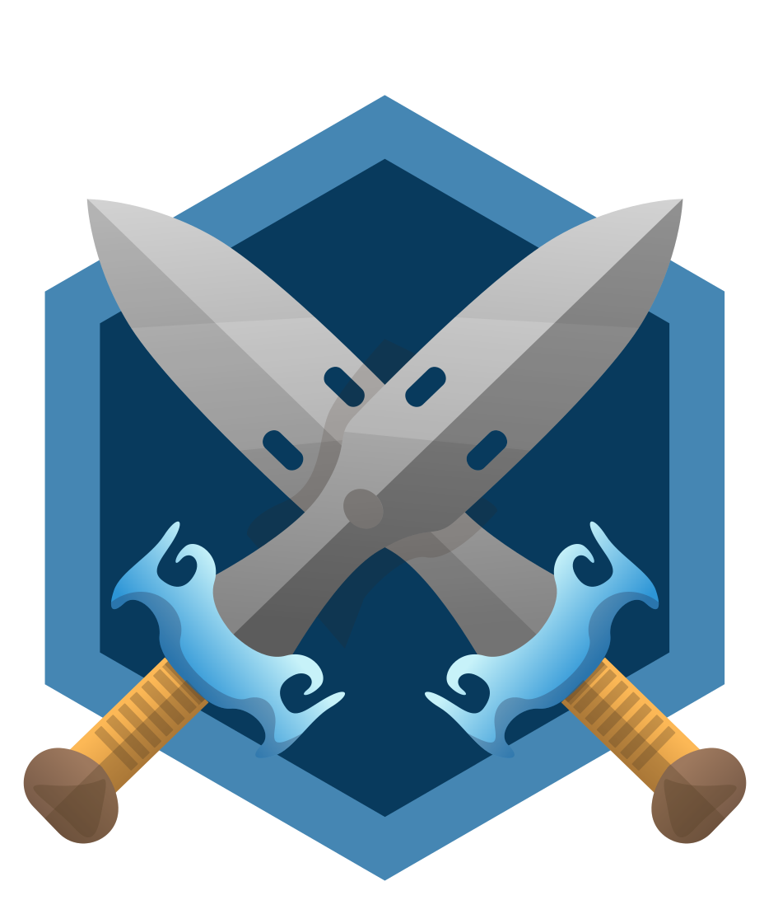
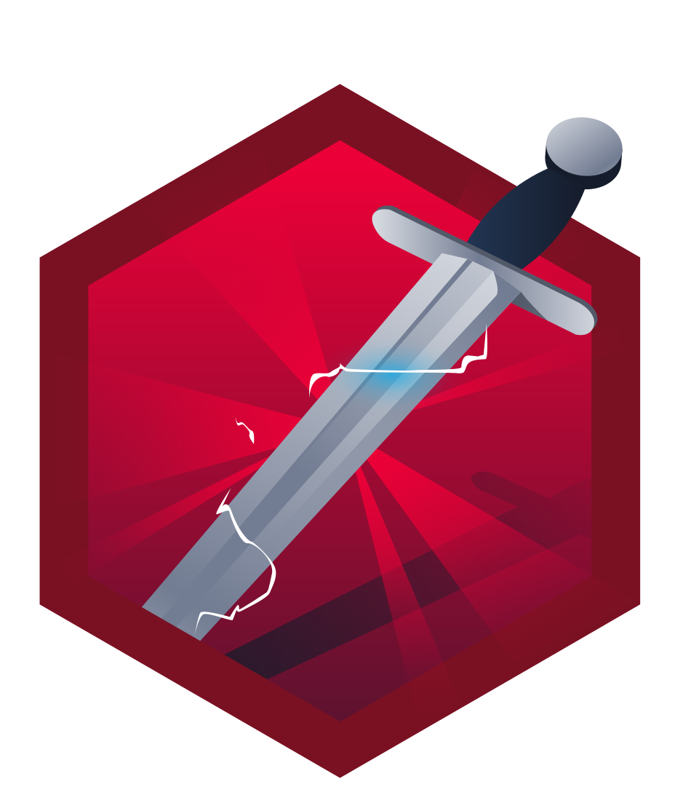

# 🔐 Information Security Platform Badges

 
 
<table border="1" cellpadding="10" cellspacing="0" style="text-align: center;">
  <thead>
    <tr>
      <th style="text-align: center;">Name</th>
      <th style="text-align: center;">Description</th>
    </tr>
  </thead>
  <tbody>
    <tr>
      <td>
      
      </td>
    <td rowspan='2'>cat linux.txt</td>
  </tr>
  <tr>
    <td>Being competent in Linux</td>
  </tr>
    <tr>
      <td style="display: flex; flex-direction: column; align-items: center; justify-content: center;">
          
          Cyber Ready
      </td>
      <td>Understanding impact of training on teams</td>
    </tr>
    <tr>
      <td style="display: flex; flex-direction: column; align-items: center; justify-content: center;">
          
          Blue
      </td>
      <td>Hacking into Windows via EternalBlue</td>
    </tr>
    <tr>
      <td style="display: flex; flex-direction: column; align-items: center; justify-content: center;">
          
          Metasploitable
      </td>
      <td>Contains the knowledge to use Metasploit.</td>
    </tr>
    <tr>
      <td style="display: flex; flex-direction: column; align-items: center; justify-content: center;">
          
          OWASP Top 10
      </td>
      <td>Understanding every OWASP vulnerability</td>
    </tr>
    <tr>
      <td style="display: flex; flex-direction: column; align-items: center; justify-content: center;">
          
          Pentesting Principles
      </td>
      <td>Completing the 'Introduction to Pentesting' module.</td>
    </tr>
    <tr>
      <td style="display: flex; flex-direction: column; align-items: center; justify-content: center;">
          
          Shield Apprentice
      </td>
      <td>Completing the FlareVM room</td>
    </tr>
    <tr>
      <td style="display: flex; flex-direction: column; align-items: center; justify-content: center;">
          
          Sword Apprentice
      </td>
      <td>Completing the SQLMap room.</td>
    </tr>
  </tbody>
</table>

