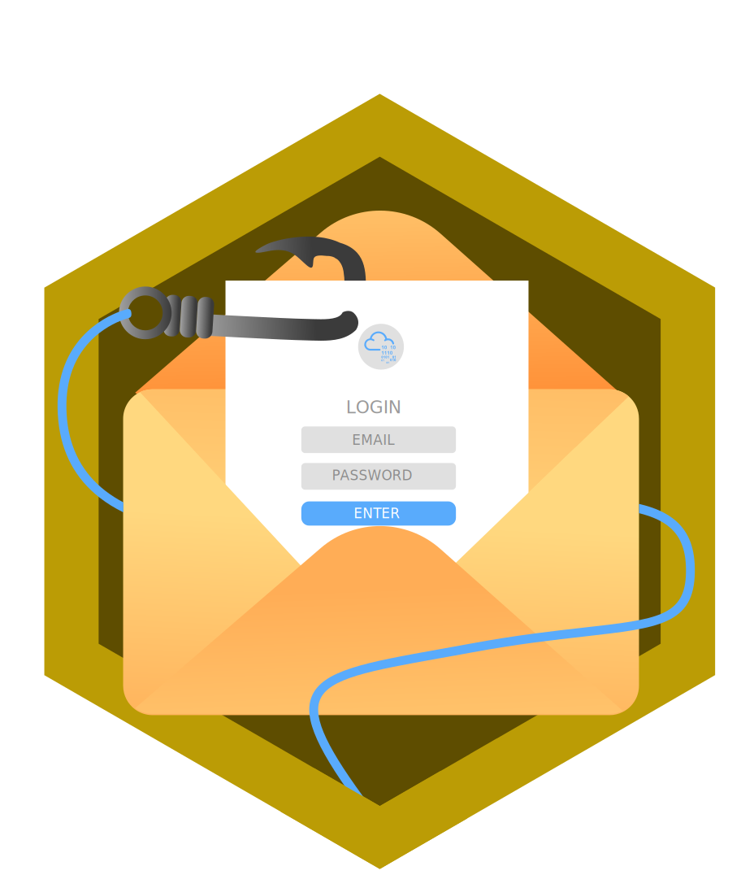

<!-- markdownlint-disable MD033 -->
<h1 align="center">🔐 Information Security Platform Badges</h1>

  
  
  
  
  
  

  <table>
    <thead>
      <tr>
        <th style="text-align: center;">Badge</th>
        <th style="text-align: center;">Name</th>
        <th style="text-align: center;">Description</th>
      </tr>
    </thead>
    <tbody>
      <tr>
        <td align="center">

</td>
        <td align="center">Pentesting Principles</td>
        <td>Completing the 'Introduction to Pentesting' module</td>
      </tr>
      <tr>
        <td align="center">

</td>
        <td align="center">cat linux.txt</td>
        <td>Being competent in Linux</td>
      </tr>
      <tr>
        <td align="center">

</td>
        <td align="center">Cyber Ready</td>
        <td>Understanding impact of training on teams</td>
      </tr>
      <tr>
        <td align="center">

</td>
        <td align="center">Metasploitable</td>
        <td>Contains the knowledge to use Metasploit</td>
      </tr>
      <tr>
        <td align="center">

</td>
        <td align="center">Blue</td>
        <td>Hacking into Windows via EternalBlue</td>
      </tr>
      <tr>
        <td align="center">

</td>
        <td align="center">OWASP Top 10</td>
        <td>Understanding every OWASP vulnerability</td>
      </tr>
      <tr>
        <td align="center">

</td>
        <td align="center">Sword Apprentice</td>
        <td>Completing the SQLMap room</td>
      </tr>
      <tr>
        <td align="center">

</td>
        <td align="center">Shield Apprentice</td>
        <td>Completing the FlareVM room</td>
      </tr>
      <tr>
        <td align="center">

</td>
        <td align="center">Networking Nerd</td>
        <td>Completing the 'Network Fundamentals' module</td>
      </tr>
      <tr>
        <td align="center">

</td>
        <td align="center">Webbed</td>
        <td>Understands how the world wide web works</td>
      </tr>
      <tr>
        <td align="center">

</td>
        <td align="center">World Wide Web</td>
        <td>Completing the 'How The Web Works' module</td>
      </tr>
      <tr>
        <td align="center">

</td>
        <td align="center">Skilled Navigator</td>
        <td>Finishing the Eviction challenge!</td>
      </tr>
      <tr>
        <td align="center">

</td>
        <td align="center">Intro to Web Hacking</td>
        <td>Completing the 'Introduction to Web Hacking' module</td>
      </tr>
      <tr>
        <td align="center">

</td>
        <td align="center">Burp'ed</td>
        <td>Completing the Burp Suite module</td>
      </tr>
      <tr>
        <td align="center">

</td>
        <td align="center">Advent of Cyber 2024</td>
        <td>Completing Advent of Cyber 2024!</td>
      </tr>
      <tr>
        <td align="center">

</td>
        <td align="center">Phishing</td>
        <td>Completing the 'Phishing' module</td>
      </tr>
      <tr>
        <td align="center">

</td>
        <td align="center">Friday Fixer</td>
        <td>Finishing the Friday Overtime challenge!</td>
      </tr>
      <tr>
        <td align="center">

</td>
       <td align="center">Introduction to Security Engineering</td>
        <td>Completed the Security Engineer Intro room!</td>
      </tr>
      <tr>
        <td align="center">

</td>
        <td align="center">Calculated Risk</td>
        <td>Completed the Risk Management room!</td>
      </tr>
    </tbody>
  </table>

