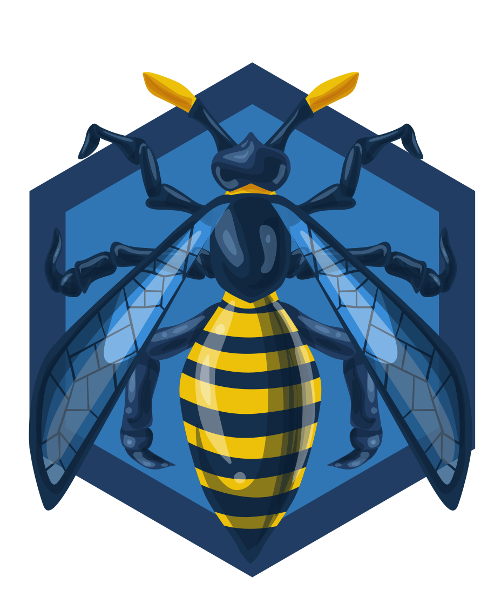
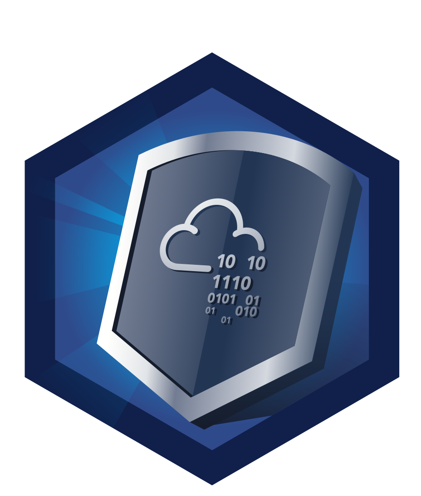
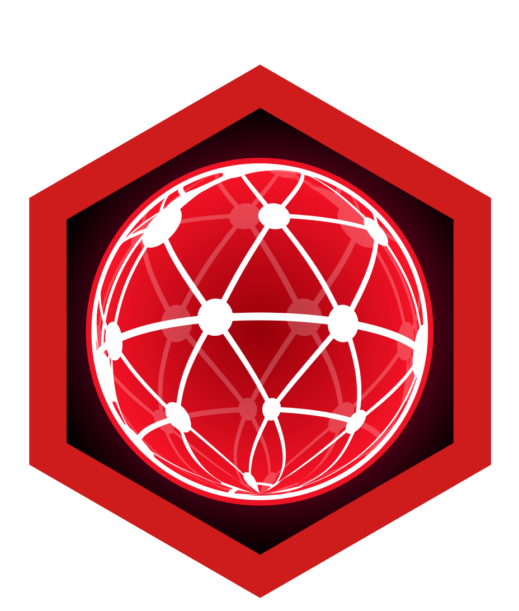
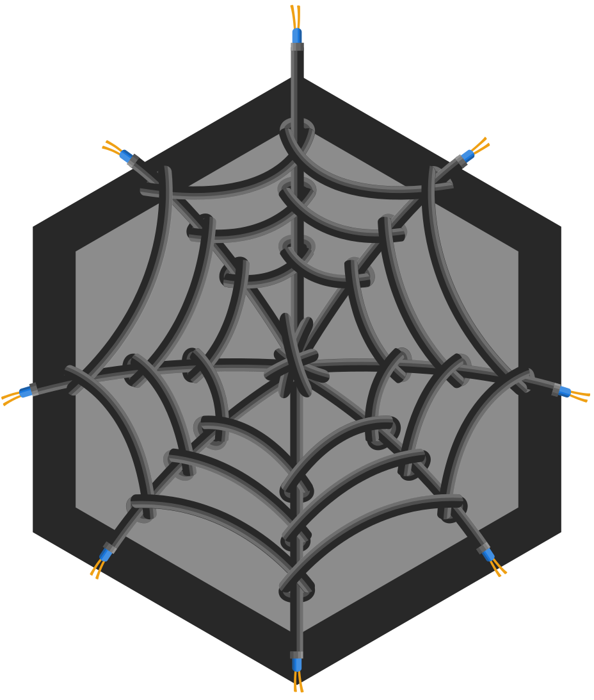

# 🔐 Information Security Platform Badges

| Badge                                           | Name                  | Description                                         |
| ----------------------------------------------- | --------------------- | --------------------------------------------------- |
|  | Pentesting Principles | Completing the 'Introduction to Pentesting' module  |
|                     | cat linux.txt         | Being competent in Linux                            |
|               | Cyber Ready           | Understanding impact of training on teams           |
|                | Metasploitable        | Contains the knowledge to use Metasploit            |
|                      | Blue                  | Hacking into Windows via EternalBlue                |
|                | OWASP Top 10          | Understanding every OWASP vulnerability             |
|           | Sword Apprentice      | Completing the SQLMap room                          |
|          | Shield Apprentice     | Completing the FlareVM room                         |
|       | Networking Nerd       | Completing the 'Network Fundamentals' module        |
|                    | Webbed                | Understands how the world wide web works            |
|            | Word Wide Web         | Completing the 'How The Web Works' module           |
|        | Intro to Web Hacking  | Completing the 'Introduction to Web Hacking' module |
|                 | Burp'ed               | Completing the Burp Suite module                    |
